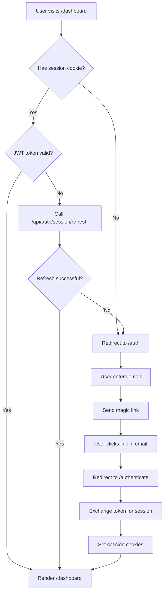
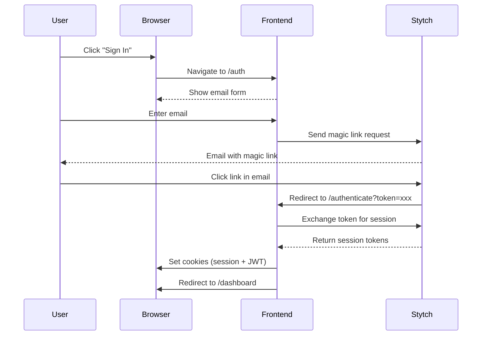
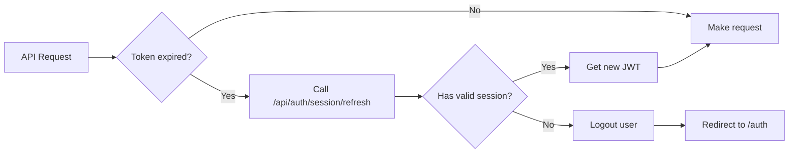

# Authentication

This guide explains how authentication works and how to check if a user is logged in.

## How Authentication Works

The app uses **Stytch B2B** for authentication with magic link emails. No passwords required.

### Authentication Flow



##  Token System

The app uses **two cookies** for authentication:

1. **Session Token** (`stytch_session`)
   - HttpOnly cookie (JavaScript cannot read it)
   - Sent to Stytch backend to get JWT
   - Used for token refresh

2. **JWT Token** (`stytch_session_jwt`)
   - Readable by JavaScript
   - Attached to API requests as `Authorization: Bearer <token>`
   - Contains user info and expiration

### Token Lifecycle

- **Duration**: 8 hours (480 minutes)
- **Auto-Refresh**: Happens automatically when expired
- **Grace Period**: 60 seconds (handles clock skew)

## Checking if User is Authenticated

### In Server Components

Use `getMemberSession()` to check authentication.

**File**: `lib/auth/stytch/server.ts`

```typescript
import { getMemberSession } from '@/lib/auth/stytch/server';

export default async function DashboardPage() {
  const session = await getMemberSession();

  // Not authenticated
  if (!session) {
    return <div>Please log in</div>;
  }

  // Authenticated
  return <div>Welcome, {session.member.email}</div>;
}
```

### Requiring Authentication

Use `requireMemberSession()` to enforce authentication. It automatically redirects if not logged in.

```typescript
import { requireMemberSession } from '@/lib/auth/stytch/server';

export default async function ProtectedPage() {
  // Will redirect to /auth if not logged in
  const session = await requireMemberSession();

  return <div>Protected content for {session.member.email}</div>;
}
```

### In Client Components

Use `useStytchMember()` hook from Stytch SDK.

```typescript
'use client';
import { useStytchMember } from '@stytch/nextjs/b2b';

export function UserProfile() {
  const { member, isInitialized } = useStytchMember();

  if (!isInitialized) {
    return <div>Loading...</div>;
  }

  if (!member) {
    return <div>Not logged in</div>;
  }

  return <div>Hello, {member.email_address}</div>;
}
```

## Protected vs Public Routes

### Protected Routes

These routes require authentication. Defined in `middleware.ts`:

- `/dashboard`
- `/dashboard/settings`
- Any route starting with `/dashboard/`

If you visit a protected route without being logged in, you'll be redirected to `/auth`.

### Public Routes

These routes don't require authentication:

- `/` (homepage)
- `/auth` (login page)
- `/authenticate` (magic link callback)
- `/signup` (signup page)
- `/api/auth/*` (auth API routes)

## Login Flow



## Logout Flow

To log out a user, redirect them to the logout API:

```typescript
// In a client component
'use client';

export function LogoutButton() {
  const handleLogout = () => {
    window.location.href = '/api/auth/logout';
  };

  return <button onClick={handleLogout}>Log Out</button>;
}
```

The logout API will:
1. Clear session cookies
2. Redirect to login page

## Token Refresh

When a JWT expires, the app automatically refreshes it.

### Token Refresh Flow



This happens automatically in `lib/api/api/client/token-manager.ts`.

### Retry Logic

If token refresh fails:
- **Retry** 3 times
- **Wait** 1s, then 2s, then 4s (exponential backoff)
- **Logout** if all retries fail

## Security Features

### Cookie Security

- **HttpOnly**: Session token cannot be read by JavaScript
- **Secure**: Cookies only sent over HTTPS (in production)
- **SameSite**: Lax (protects against CSRF)
- **Path**: `/` (available to all routes)

### Token Storage

- **Session token**: Server-side only (secure)
- **JWT token**: Client + server (needed for API calls)
- **In-memory cache**: Browser caches JWT to reduce cookie reads

## Common Patterns

### Check Auth in API Route

```typescript
// app/api/data/route.ts
import { getMemberSession } from '@/lib/auth/stytch/server';

export async function GET() {
  const session = await getMemberSession();

  if (!session) {
    return NextResponse.json(
      { error: 'Unauthorized' },
      { status: 401 }
    );
  }

  // Authenticated logic
  return NextResponse.json({ data: 'secret data' });
}
```

### Conditional Rendering Based on Auth

```typescript
'use client';

export function ConditionalContent() {
  const { member } = useStytchMember();

  return (
    <div>
      {member ? (
        <div>Logged in as {member.email_address}</div>
      ) : (
        <a href="/auth">Please log in</a>
      )}
    </div>
  );
}
```

## Key Files

- **`middleware.ts`** - Route protection logic
- **`lib/auth/stytch/server.ts`** - Server-side auth helpers
- **`lib/api/api/client/token-manager.ts`** - Token management
- **`lib/auth/constants.ts`** - Auth configuration
- **`app/api/auth/session/refresh/route.ts`** - Token refresh endpoint
- **`app/api/auth/logout/route.ts`** - Logout endpoint
- **`app/auth/page.tsx`** - Login page
- **`app/authenticate/page.tsx`** - Magic link callback

## Next Steps

👉 **Learn about**: [Permissions & Roles](./03-permissions-and-roles.md)
