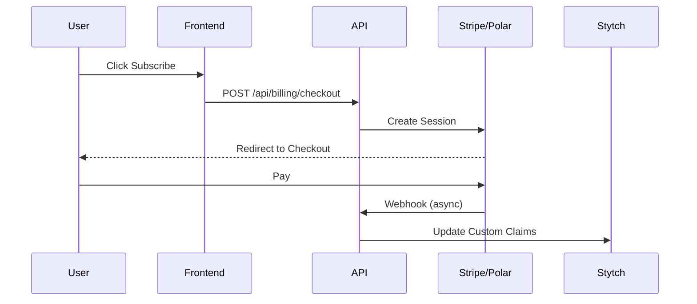

# Payments & Billing

The starter supports Stripe or Polar. Subscription status is managed via Stytch Custom Claims.

## Subscription Status

- **`active` / `trialing`**: User has access.
- **`past_due` / `canceled` / `unpaid`**: Access restricted.

## Checking Payment Status

Use `hasActiveSubscription()` helper function.

**File**: `lib/auth/subscription.ts`

### Server-Side Check

```typescript
import { hasActiveSubscription } from '@/lib/auth/subscription';

export default async function Page() {
  const session = await requireMemberSession();
  if (!hasActiveSubscription(session)) {
    return <div>Upgrade to access</div>;
  }
  return <PremiumContent />;
}
```

### Client-Side Check

```typescript
'use client';
import { hasActiveSubscription } from '@/lib/auth/subscription';

export function Feature() {
  const { session, member } = useStytchMemberSession();
  if (!hasActiveSubscription(session, member)) {
    return <button>Subscribe</button>;
  }
  return <FeatureContent />;
}
```

## Payment Flow Architecture



## Paywalls

We include a pre-built Paywall component.

**File**: `components/billing/subscription-paywall.tsx`

```typescript
import { SubscriptionPaywall } from '@/components/billing/subscription-paywall';

export default function Page() {
  return (
    <SubscriptionPaywall>
      <ProtectedContent />
    </SubscriptionPaywall>
  );
}
```

## API Route Protection

Always verify logic in your API routes, returning `402 Payment Required` if needed.

```typescript
if (!hasActiveSubscription(session)) {
  return NextResponse.json({ error: 'Upgrade required' }, { status: 402 });
}
```

## Webhooks

Webhooks handle status updates asynchronously.

**File**: `app/api/billing/webhook/route.ts`

## Next Steps

👉 **Learn about**: [Making API Requests](./05-making-api-requests.md)
