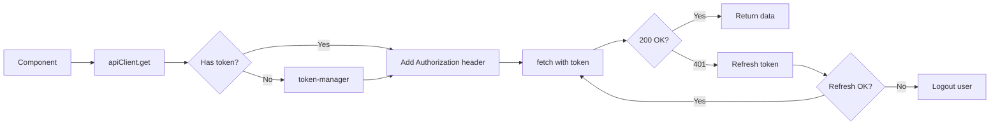
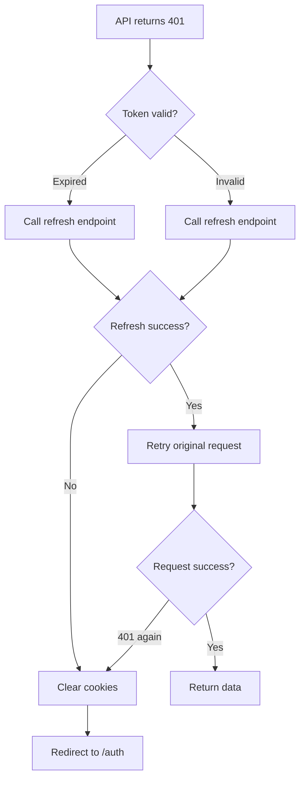

# Making API Requests

This guide explains how to make API requests using the API client and repository pattern.

## API Client Overview

The app uses a centralized API client that handles:
- Automatic authentication (adds Bearer token)
- Token refresh on expiration
- Error handling
- Next.js 16 caching options

**File**: `lib/api/api/client/api-client.ts`

## Basic Usage

### Import the API Client

```typescript
import { apiClient } from '@/lib/api/api/client/api-client';
```

### Make a GET Request

```typescript
const data = await apiClient.get<ResponseType>('/endpoint');
```

### Make a POST Request

```typescript
const result = await apiClient.post<ResponseType>('/endpoint', {
  name: 'value',
  count: 42
});
```

### Make a PUT Request

```typescript
const updated = await apiClient.put<ResponseType>('/endpoint/123', {
  name: 'new value'
});
```

### Make a DELETE Request

```typescript
await apiClient.delete('/endpoint/123');
```

## API Request Flow



## Handling 401 Errors

When a request returns 401 (unauthorized), the API client automatically:

1. Attempts to refresh the token
2. Retries the request with new token
3. If refresh fails, logs out the user



This happens automatically - you don't need to handle it.

## Error Handling

The API client throws `ApiError` for HTTP errors.

```typescript
import { apiClient, ApiError } from '@/lib/api/api/client/api-client';

try {
  const data = await apiClient.post('/endpoint', payload);
} catch (error) {
  if (error instanceof ApiError) {
    console.error('Status:', error.status);    // 404, 500, etc.
    console.error('Code:', error.code);        // "HTTP_404", "SESSION_EXPIRED"
    console.error('Message:', error.message);  // Error message
    console.error('Details:', error.details);  // Extra error data
  }
}
```

## Next.js 16 Caching Options

The API client supports Next.js 16 fetch options.

### No Cache (Default)

```typescript
const data = await apiClient.get('/endpoint', {
  cache: 'no-store'  // Don't cache (default for authenticated requests)
});
```

### Force Cache

```typescript
const data = await apiClient.get('/public-data', {
  cache: 'force-cache'  // Cache indefinitely
});
```

### Revalidate After Time

```typescript
const data = await apiClient.get('/products', {
  next: {
    revalidate: 3600  // Refresh every hour (3600 seconds)
  }
});
```

### Tag-Based Revalidation

```typescript
const data = await apiClient.get('/invoices', {
  next: {
    tags: ['invoices', 'financial-data']
  }
});

// Later, revalidate all 'invoices' requests
import { revalidateTag } from 'next/cache';
revalidateTag('invoices');
```

## Repository Pattern

**Don't call** the API client directly in components. Use **repositories** instead.

### What is a Repository?

A repository is a class that wraps API calls for a specific resource.

**Benefits:**
- Centralized API logic
- Type-safe responses
- Easy to mock for testing
- Consistent error handling

### Using a Repository

```typescript
import { profileRepository } from '@/lib/api/api/repositories/profile-repository';

// Server component
export default async function ProfilePage() {
  const session = await requireMemberSession();

  // Use repository
  const profile = await profileRepository.getProfile(session.session_jwt);

  return <div>{profile.name}</div>;
}
```

### Repository Structure

**File**: `lib/api/api/repositories/profile-repository.ts`

```typescript
class ProfileRepository {
  async getProfile(sessionToken?: string) {
    const options = sessionToken
      ? { headers: { Authorization: `Bearer ${sessionToken}` } }
      : undefined;

    return apiClient.get<ProfileResponseDto>('/auth/profile/me', options);
  }
}

export const profileRepository = new ProfileRepository();
```

## Available Repositories

**File**: `lib/api/api/repositories/`

- **`profile-repository.ts`** - User profile
- **`member-repository.ts`** - Team members
- **`document-repository.ts`** - Documents
- **`rbac-repository.ts`** - Roles and permissions
- **`signup-repository.ts`** - Organization signup
- **`cognitive-repository.ts`** - AI chat

## Skip Authentication

For public endpoints that don't require authentication:

```typescript
const data = await apiClient.get('/public-data', {
  skipAuth: true
});
```

This skips adding the `Authorization` header.

## Custom Headers

Add custom headers to any request:

```typescript
const data = await apiClient.post('/endpoint', payload, {
  headers: {
    'X-Custom-Header': 'value'
  }
});
```

## File Uploads

The API client supports `FormData` for file uploads.

```typescript
const formData = new FormData();
formData.append('file', fileBlob);
formData.append('name', 'document.pdf');

const result = await apiClient.post('/upload', formData);
```

The client automatically:
- Detects FormData
- Sets correct `Content-Type` header
- Sends as multipart/form-data

## Common Patterns

### Fetching Data in Server Component

```typescript
import { requireMemberSession } from '@/lib/auth/stytch/server';
import { invoiceRepository } from '@/lib/api/api/repositories/invoice-repository';

export default async function InvoicesPage() {
  const session = await requireMemberSession();

  // Fetch data using repository
  const invoices = await invoiceRepository.list(session.session_jwt);

  return <InvoiceList invoices={invoices} />;
}
```

### Fetching Data in Client Component

Use React Query hooks (covered in [Using Hooks](./08-using-hooks.md)):

```typescript
'use client';
import { useInvoicesQuery } from '@/lib/hooks/queries/use-invoices-query';

export function InvoiceList() {
  const { data: invoices, isLoading } = useInvoicesQuery();

  if (isLoading) return <div>Loading...</div>;

  return <div>{invoices.map(inv => ...)}</div>;
}
```

### Conditional Requests

```typescript
export default async function DataPage({ shouldFetchData }) {
  if (!shouldFetchData) {
    return <div>No data</div>;
  }

  const session = await requireMemberSession();
  const data = await dataRepository.fetch(session.session_jwt);

  return <DataView data={data} />;
}
```

### Parallel Requests

Make multiple requests in parallel:

```typescript
export default async function DashboardPage() {
  const session = await requireMemberSession();

  // Fetch in parallel
  const [profile, invoices, stats] = await Promise.all([
    profileRepository.getProfile(session.session_jwt),
    invoiceRepository.list(session.session_jwt),
    statsRepository.get(session.session_jwt),
  ]);

  return <Dashboard profile={profile} invoices={invoices} stats={stats} />;
}
```

## Testing with Mocks

Mock the API client for testing:

```typescript
import { apiClient } from '@/lib/api/api/client/api-client';

// Mock implementation
jest.spyOn(apiClient, 'get').mockResolvedValue({
  id: 1,
  name: 'Test'
});

// Test your component
const result = await myFunction();
expect(result.name).toBe('Test');
```

## Key Files

- **`lib/api/api/client/api-client.ts`** - Main API client
- **`lib/api/api/client/token-manager.ts`** - Token management
- **`lib/api/api/repositories/`** - All repositories
- **`lib/api/api/dto/`** - TypeScript types for API responses

## Best Practices

1. **Always use repositories** - Don't call apiClient directly from components
2. **Handle errors** - Wrap calls in try/catch
3. **Use TypeScript types** - Define response types
4. **Cache wisely** - Use `next.revalidate` for data that changes
5. **Skip auth sparingly** - Only for truly public endpoints
6. **Test with mocks** - Mock repositories, not the API client

## Next Steps

👉 **Learn about**: [Creating Pages](./06-creating-pages.md)
