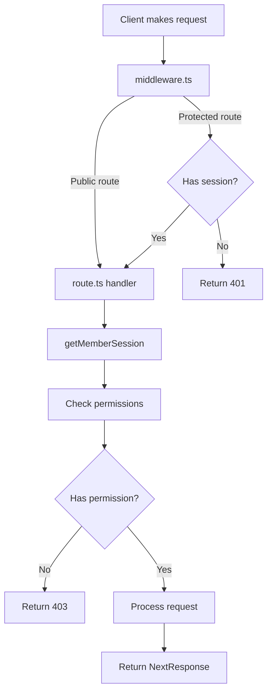

# Creating APIs

This guide shows how to create new API endpoints.

## API Route Structure

API routes live in `app/api/` and use file-based routing.

### File Structure

```
app/api/
├── vendors/
│   ├── route.ts           # GET /api/vendors, POST /api/vendors
│   └── [id]/
│       └── route.ts       # GET /api/vendors/123, DELETE /api/vendors/123
├── auth/
│   ├── logout/route.ts    # POST /api/auth/logout
│   └── magic-link/route.ts
```

## Creating a Basic API Route

### 1. Create the File

```typescript
// app/api/vendors/route.ts
import { NextResponse } from 'next/server';
import { requireMemberSession } from '@/lib/auth/stytch/server';

export async function GET(request: Request) {
  // Check authentication
  const session = await getMemberSession();
  if (!session) {
    return NextResponse.json(
      { error: 'Unauthorized' },
      { status: 401 }
    );
  }

  // Fetch data
  const vendors = await vendorRepository.list(session.session_jwt);

  // Return response
  return NextResponse.json(vendors);
}
```

### 2. HTTP Methods

Export functions for each HTTP method:

```typescript
// GET /api/vendors
export async function GET(request: Request) {
  // Handle GET request
}

// POST /api/vendors
export async function POST(request: Request) {
  // Handle POST request
}

// PUT /api/vendors
export async function PUT(request: Request) {
  // Handle PUT request
}

// DELETE /api/vendors
export async function DELETE(request: Request) {
  // Handle DELETE request
}
```

### 3. Access the API

Call from frontend:

```typescript
const response = await fetch('/api/vendors');
const vendors = await response.json();
```

## API Request Flow



## Authentication in API Routes

### Check if Authenticated

```typescript
import { getMemberSession } from '@/lib/auth/stytch/server';

export async function GET() {
  const session = await getMemberSession();

  if (!session) {
    return NextResponse.json(
      { error: 'Not authenticated' },
      { status: 401 }
    );
  }

  // Authenticated logic
}
```

### Require Authentication

```typescript
import { requireMemberSession } from '@/lib/auth/stytch/server';

export async function GET() {
  // Throws error if not authenticated
  const session = await requireMemberSession();

  // This code only runs if authenticated
  return NextResponse.json({ success: true });
}
```

## Permission Checks in APIs

```typescript
import { getServerPermissions } from '@/lib/auth/server-permissions';

export async function POST(request: Request) {
  const session = await requireMemberSession();
  const permissions = await getServerPermissions(session);

  if (!permissions.canCreateVendors) {
    return NextResponse.json(
      { error: 'Permission denied' },
      { status: 403 }
    );
  }

  // Create vendor logic
}
```

## Reading Request Body

```typescript
export async function POST(request: Request) {
  // Parse JSON body
  const body = await request.json();

  const { name, email } = body;

  // Validate
  if (!name || !email) {
    return NextResponse.json(
      { error: 'Missing required fields' },
      { status: 400 }
    );
  }

  // Process request
}
```

## Reading Query Parameters

```typescript
export async function GET(request: Request) {
  const { searchParams } = new URL(request.url);

  const page = searchParams.get('page') || '1';
  const limit = searchParams.get('limit') || '10';

  // Use parameters
  const results = await repository.list({
    page: parseInt(page),
    limit: parseInt(limit)
  });

  return NextResponse.json(results);
}
```

## Dynamic Routes

### Create Dynamic Route

```typescript
// app/api/vendors/[id]/route.ts

export async function GET(
  request: Request,
  { params }: { params: { id: string } }
) {
  const { id } = params;

  const vendor = await vendorRepository.get(id);

  if (!vendor) {
    return NextResponse.json(
      { error: 'Not found' },
      { status: 404 }
    );
  }

  return NextResponse.json(vendor);
}
```

### Access Dynamic Route

```typescript
// GET /api/vendors/123
const response = await fetch('/api/vendors/123');
```

## File Uploads

Handle `multipart/form-data` for file uploads:

```typescript
export async function POST(request: Request) {
  const formData = await request.formData();

  const file = formData.get('file') as File;
  const name = formData.get('name') as string;

  if (!file) {
    return NextResponse.json(
      { error: 'No file provided' },
      { status: 400 }
    );
  }

  // Process file
  const buffer = await file.arrayBuffer();

  // Save or upload file
  await saveFile(buffer, file.name);

  return NextResponse.json({ success: true });
}
```

## Error Handling

```typescript
export async function POST(request: Request) {
  try {
    const body = await request.json();

    // Process request
    const result = await processData(body);

    return NextResponse.json(result);
  } catch (error) {
    console.error('API Error:', error);

    return NextResponse.json(
      { error: 'Internal server error' },
      { status: 500 }
    );
  }
}
```

## Response Formats

### Success Response

```typescript
return NextResponse.json({
  success: true,
  data: { id: 1, name: 'Vendor' }
});
```

### Error Response

```typescript
return NextResponse.json(
  {
    error: 'Validation failed',
    details: { name: 'Required' }
  },
  { status: 400 }
);
```

### Status Codes

- `200` - OK
- `201` - Created
- `400` - Bad Request
- `401` - Unauthorized
- `403` - Forbidden
- `404` - Not Found
- `500` - Internal Server Error

## Using Repositories in APIs

Always use repositories for data access:

```typescript
import { vendorRepository } from '@/lib/api/api/repositories/vendor-repository';

export async function GET() {
  const session = await requireMemberSession();

  // Use repository
  const vendors = await vendorRepository.list(session.session_jwt);

  return NextResponse.json(vendors);
}
```

## CORS Configuration

For external API access, add CORS headers:

```typescript
export async function GET(request: Request) {
  const response = NextResponse.json({ data: 'value' });

  response.headers.set('Access-Control-Allow-Origin', '*');
  response.headers.set('Access-Control-Allow-Methods', 'GET, POST, PUT, DELETE');

  return response;
}
```

## Webhooks

Handle webhook POST requests:

```typescript
// app/api/webhooks/stripe/route.ts
import { headers } from 'next/headers';

export async function POST(request: Request) {
  const body = await request.text();
  const signature = headers().get('stripe-signature');

  // Verify webhook signature
  const event = verifyStripeWebhook(body, signature);

  // Process event
  if (event.type === 'invoice.paid') {
    await handleInvoicePaid(event.data);
  }

  return NextResponse.json({ received: true });
}
```

## Common Patterns

### List Endpoint

```typescript
export async function GET(request: Request) {
  const session = await requireMemberSession();
  const items = await repository.list(session.session_jwt);
  return NextResponse.json(items);
}
```

### Create Endpoint

```typescript
export async function POST(request: Request) {
  const session = await requireMemberSession();
  const permissions = await getServerPermissions(session);

  if (!permissions.canCreate) {
    return NextResponse.json({ error: 'Forbidden' }, { status: 403 });
  }

  const body = await request.json();
  const item = await repository.create(body, session.session_jwt);

  return NextResponse.json(item, { status: 201 });
}
```

### Update Endpoint

```typescript
export async function PUT(
  request: Request,
  { params }: { params: { id: string } }
) {
  const session = await requireMemberSession();
  const body = await request.json();

  const updated = await repository.update(
    params.id,
    body,
    session.session_jwt
  );

  return NextResponse.json(updated);
}
```

### Delete Endpoint

```typescript
export async function DELETE(
  request: Request,
  { params }: { params: { id: string } }
) {
  const session = await requireMemberSession();
  const permissions = await getServerPermissions(session);

  if (!permissions.canDelete) {
    return NextResponse.json({ error: 'Forbidden' }, { status: 403 });
  }

  await repository.delete(params.id, session.session_jwt);

  return NextResponse.json({ success: true });
}
```

## Testing APIs

### With curl

```bash
curl http://localhost:3000/api/vendors

curl -X POST http://localhost:3000/api/vendors \
  -H "Content-Type: application/json" \
  -d '{"name":"Acme Corp"}'
```

### With Postman

1. Import the API
2. Add authentication cookie
3. Test each endpoint

## Key Files

- **`app/api/`** - All API routes
- **`lib/api/api/repositories/`** - Data access layer
- **`lib/auth/stytch/server.ts`** - Auth helpers

## Best Practices

1. **Always check authentication** in protected routes
2. **Re-check permissions** - don't trust client
3. **Use repositories** - don't call backend directly
4. **Validate input** before processing
5. **Handle errors** gracefully
6. **Return proper status codes**
7. **Log errors** for debugging

## Next Steps

👉 **Learn about**: [Using Hooks](./08-using-hooks.md)
