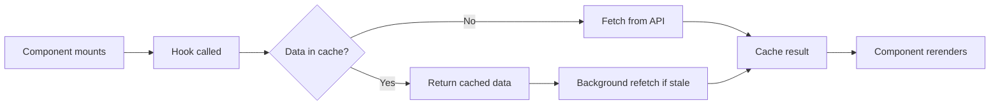
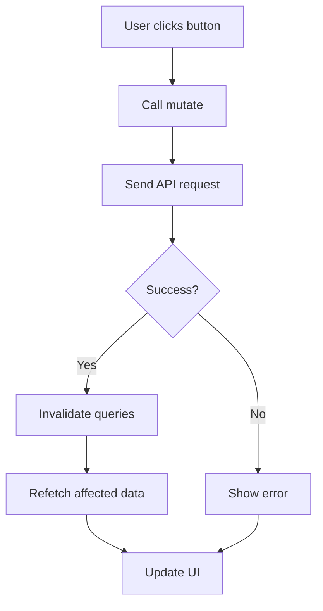

# Using Hooks

This guide explains how to use React hooks for data fetching and state management.

## Hook Types

The app has two types of hooks:

- **Query Hooks** - Fetch data (GET requests)
- **Mutation Hooks** - Modify data (POST, PUT, DELETE requests)

All hooks use **TanStack React Query** for caching and state management.

## Query Hooks (Read Operations)

Query hooks fetch data and cache it automatically.

### Using a Query Hook

```typescript
'use client';
import { useProfileQuery } from '@/lib/hooks/queries/use-profile-query';

export function UserProfile() {
  const { data, isLoading, error } = useProfileQuery();

  if (isLoading) return <div>Loading...</div>;
  if (error) return <div>Error: {error.message}</div>;

  return <div>Hello, {data.name}</div>;
}
```

### Query Hook Lifecycle



### Available Query Hooks

**File**: `lib/hooks/queries/`

- **`useProfileQuery()`** - Current user profile
- **`useSubscriptionQuery()`** - Subscription status
- **`useProductsQuery()`** - Product list
- **`useMembersQuery()`** - Team members
- **`useDocumentsQuery()`** - Document list
- **`useSessionsQuery()`** - Audit sessions
- **`useInvoicesQuery()`** - Invoice list
- **`useVendorsQuery()`** - Vendor list

## Mutation Hooks (Write Operations)

Mutation hooks modify data on the server.

### Using a Mutation Hook

```typescript
'use client';
import { useUpdateProfile } from '@/lib/hooks/mutations/use-update-profile';

export function ProfileForm() {
  const { mutate, isPending, error } = useUpdateProfile();

  const handleSubmit = () => {
    mutate({
      name: 'New Name',
      email: 'new@example.com'
    });
  };

  return (
    <div>
      <button onClick={handleSubmit} disabled={isPending}>
        {isPending ? 'Saving...' : 'Save'}
      </button>
      {error && <div>Error: {error.message}</div>}
    </div>
  );
}
```

### Mutation Flow



### Available Mutation Hooks

**File**: `lib/hooks/mutations/`

- **`useUpdateProfile()`** - Update user profile
- **`useInviteMember()`** - Invite team member
- **`useRemoveMember()`** - Remove team member
- **`useResendInvitation()`** - Resend invitation
- **`useUploadDocument()`** - Upload document
- **`useDeleteDocument()`** - Delete document
- **`useChat()`** - AI chat
- **`useCreateInvoice()`** - Create invoice
- **`useDeleteInvoice()`** - Delete invoice

## Permission Hook

The `usePermissions()` hook provides auth state and permission checks.

**File**: `lib/hooks/use-permissions.ts`

```typescript
'use client';
import { usePermissions } from '@/lib/hooks/use-permissions';

export function PermissionGate() {
  const {
    profile,              // User profile
    roles,                // User roles array
    permissions,          // Permissions array
    hasPermission,        // Check single permission
    hasAnyPermission,     // Check if has any
    hasAllPermissions,    // Check if has all
    hasRole,              // Check single role
    hasAnyRole,           // Check if has any role
    hasAllRoles,          // Check if has all roles
    isAuthenticated,      // Boolean
    isInitialized,        // Boolean (Stytch ready)
    updateAuthState,      // Manual update function
  } = usePermissions();

  if (!isAuthenticated) {
    return <div>Please log in</div>;
  }

  return (
    <div>
      {hasPermission('invoice:create') && <CreateButton />}
      {hasRole('admin') && <AdminPanel />}
    </div>
  );
}
```

## React Query Configuration

Query hooks have default settings:

- **Stale time**: 5 minutes (data considered fresh)
- **Cache time**: 10 minutes (how long to keep in cache)
- **Retry**: 3 attempts on failure
- **Refetch on window focus**: Yes

### Custom Configuration

Override defaults in individual hooks:

```typescript
const { data } = useProfileQuery({
  staleTime: 60000,      // 1 minute
  retry: 5,              // Retry 5 times
  refetchOnWindowFocus: false,
});
```

## Advanced Hook Patterns

### Dependent Queries

Only run query if condition is met:

```typescript
const { data: profile } = useProfileQuery();

const { data: documents } = useDocumentsQuery({
  enabled: !!profile?.id  // Only fetch if profile exists
});
```

### Optimistic Updates

Update UI immediately, rollback if fails:

```typescript
const queryClient = useQueryClient();
const { mutate } = useUpdateProfile({
  onMutate: async (newData) => {
    // Cancel outgoing queries
    await queryClient.cancelQueries({ queryKey: ['profile'] });

    // Get current data
    const previous = queryClient.getQueryData(['profile']);

    // Optimistically update
    queryClient.setQueryData(['profile'], newData);

    // Return rollback value
    return { previous };
  },
  onError: (err, newData, context) => {
    // Rollback on error
    queryClient.setQueryData(['profile'], context.previous);
  }
});
```

### Manual Refetch

Trigger refetch manually:

```typescript
const { data, refetch } = useProfileQuery();

<button onClick={() => refetch()}>
  Refresh
</button>
```

### Invalidate Queries

Force refetch of specific queries:

```typescript
import { useQueryClient } from '@tanstack/react-query';

const queryClient = useQueryClient();

// Invalidate all profile queries
queryClient.invalidateQueries({ queryKey: ['profile'] });

// Invalidate specific query
queryClient.invalidateQueries({ queryKey: ['invoices', '123'] });
```

## Custom Hooks

Create custom hooks for reusable logic:

```typescript
// lib/hooks/use-vendor.ts
export function useVendor(id: string) {
  return useQuery({
    queryKey: ['vendors', id],
    queryFn: () => vendorRepository.get(id),
    enabled: !!id,
  });
}

// Usage
const { data: vendor } = useVendor('123');
```

## Common Patterns

### Loading State

```typescript
const { data, isLoading } = useProfileQuery();

if (isLoading) {
  return <Spinner />;
}

return <Profile data={data} />;
```

### Error State

```typescript
const { data, error, isError } = useProfileQuery();

if (isError) {
  return <ErrorMessage error={error} />;
}

return <Profile data={data} />;
```

### Success Callback

```typescript
const { mutate } = useUpdateProfile({
  onSuccess: (data) => {
    toast.success('Profile updated!');
    router.push('/dashboard');
  },
  onError: (error) => {
    toast.error(error.message);
  }
});
```

### Combining Hooks

```typescript
export function DashboardData() {
  const { data: profile } = useProfileQuery();
  const { data: invoices } = useInvoicesQuery();
  const { data: vendors } = useVendorsQuery();

  const isLoading = !profile || !invoices || !vendors;

  if (isLoading) return <div>Loading...</div>;

  return <Dashboard profile={profile} invoices={invoices} vendors={vendors} />;
}
```

## Query Keys

Query keys identify cached data.

### Simple Key

```typescript
queryKey: ['profile']
```

### Compound Key

```typescript
queryKey: ['invoices', filters]
queryKey: ['invoice', id]
```

### Why Query Keys Matter

- **Caching**: Same key = same cached data
- **Invalidation**: Invalidate by key pattern
- **Prefetching**: Pre-load data by key

## Prefetching Data

Load data before it's needed:

```typescript
import { useQueryClient } from '@tanstack/react-query';

const queryClient = useQueryClient();

// Prefetch on hover
<Link
  href="/vendors"
  onMouseEnter={() => {
    queryClient.prefetchQuery({
      queryKey: ['vendors'],
      queryFn: () => vendorRepository.list()
    });
  }}
>
  Vendors
</Link>
```

## React Query DevTools

View cache, queries, and mutations:

```typescript
// Already included in app/layout.tsx
import { ReactQueryDevtools } from '@tanstack/react-query-devtools';

<QueryClientProvider client={queryClient}>
  <App />
  <ReactQueryDevtools initialIsOpen={false} />
</QueryClientProvider>
```

Access at bottom-right corner of screen in development.

## Key Files

- **`lib/hooks/queries/`** - All query hooks
- **`lib/hooks/mutations/`** - All mutation hooks
- **`lib/hooks/use-permissions.ts`** - Permission hook
- **`lib/providers/query-provider.tsx`** - React Query setup

## Best Practices

1. **Use hooks in client components** - Add 'use client'
2. **Handle loading states** - Show spinners/skeletons
3. **Handle errors** - Show error messages
4. **Invalidate after mutations** - Keep data fresh
5. **Use query keys consistently** - Follow naming pattern
6. **Don't fetch in loops** - Use batch queries instead
7. **Prefetch for better UX** - Load before user clicks

## Next Steps

👉 **Complete Example**: [Adding a Feature](./09-adding-a-feature.md)
